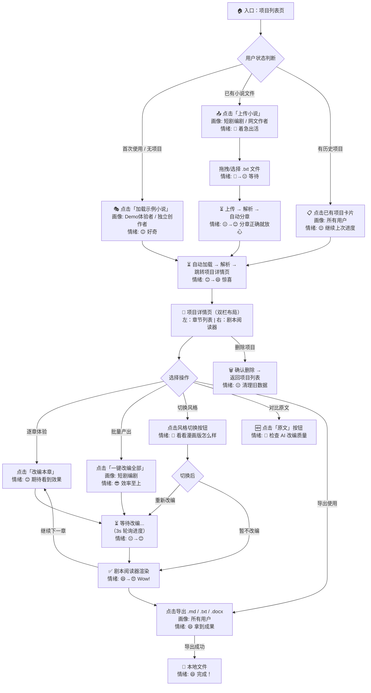
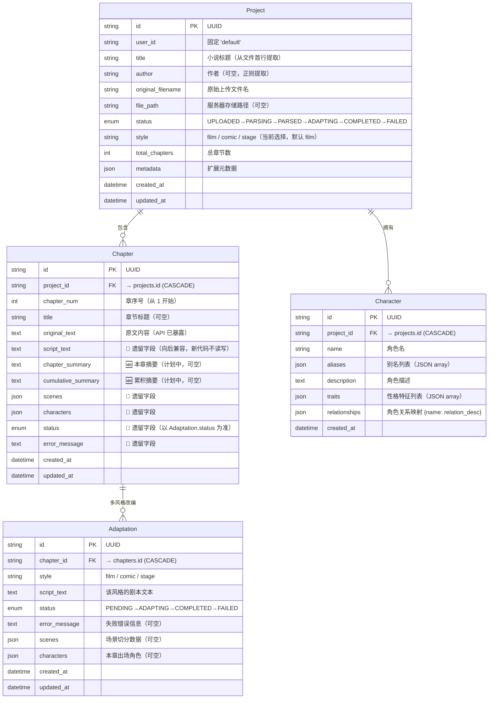

# AI 小说转剧本工具 — 信息架构设计 (IA)

> **日期**: 2026-06-06 | **方法**: information-architecture (导航地图 → 领域模型 → 页面树 → 数据流 → API 表面) | **更新**: 2026-06-06 (同步 Adaptation 表 + 质量高亮)
>
> **输入来源**: [solution-design](solution-design.md)（方案范围） + [product-requirements](product-requirements.md)（用户画像/场景） + [implementation-plan](implementation-plan.md)（MVP 边界）
>
> **性质**: Brownfield — 已有代码骨架，标注 ✅ 已有 / 🔧 修改 / 🆕 新增

---

## Step 1：用户导航地图

### 1.1 导航流程图



### 1.2 用户路径摘要

| 路径 | 入口 | 关键步骤数 | 对应画像 | 流失风险点 |
|------|------|----------|---------|-----------|
| **Demo 体验路径** | 加载示例 | 3 步 (加载→改编→查看) | Demo 体验者 | 🔴 加载超过 10 秒 |
| **上传改编路径** | 上传文件 | 4 步 (上传→分章→改编→查看) | 网文作者 | 🟡 分章不正确 |
| **快速回归路径** | 项目卡片 | 2 步 (点击→改编) | 短剧编剧 | 🟢 状态保留 |
| **导出路径** | 详情页 | 1 步 (点击导出) | 所有用户 | 🟢 格式错乱 |

---

## Step 2：领域模型

### 2.1 ER 图



### 2.2 状态机

```
Project 状态流转：
  UPLOADED → PARSING → PARSED → ADAPTING → COMPLETED
                                              ↘ FAILED

Chapter 状态流转：
  PENDING → ADAPTING → COMPLETED
                     ↘ FAILED

🆕 角色提取状态（无需独立状态）：
  上传完成 → BackgroundTask → extract_characters() → Character 表写入
  失败处理：静默失败，仅记录日志（非阻断性）
```

### 2.3 领域模型变更清单

| 实体 | 变更类型 | 字段 | 说明 |
|------|---------|------|------|
| `Adaptation` | 🆕 新增 | 完整表 | 多风格独立改编存储，UNIQUE(chapter_id, style) |
| `Chapter` | 🔧 修改 | `chapter_summary: Text?` | 🆕 本章摘要（计划中） |
| `Chapter` | 🔧 修改 | `cumulative_summary: Text?` | 🆕 累积摘要（计划中） |
| `Chapter` | 🚫 遗留 | `script_text / status / error_message / scenes / characters` | 向后兼容，新代码读写 Adaptation 表 |
| `Character` | ✅ 不变 | — | 现有字段完整 |
| `Project` | ✅ 不变 | — | 现有字段完整 |

---

## Step 3：页面/组件树

### 3.1 页面结构

```
App.tsx（根路由 — 状态机：page + selectedProjectId）
│
├─ 🏠 项目列表页 (page="projects")
│   ├─ 顶部标题栏 (已有)
│   │   ├─ Logo + 标题「AI 小说转剧本」 (已有)
│   │   └─ 🆕 「🎭 加载示例小说」按钮
│   ├─ 项目卡片网格 (已有)
│   │   ├─ ProjectCard (已有)
│   │   │   ├─ 项目标题 + 作者 (已有)
│   │   │   ├─ 状态标签 (已有)
│   │   │   ├─ 章节进度 (已有)
│   │   │   └─ 删除按钮 (已有)
│   │   └─ 🆕 空状态引导（无项目时展示）
│   └─ 🆕 拖拽上传热区（已有 UploadNovel 组件，常驻页面底部）
│
├─ 📤 上传页 (page="upload") — UploadNovel.tsx
│   ├─ 拖拽上传区 (已有)
│   │   ├─ 📁 Drop zone (.txt / .epub) (已有)
│   │   └─ 文件大小限制提示 "< 50MB" (已有)
│   ├─ 上传进度 (已有 — 浏览器原生)
│   └─ 返回按钮 (已有)
│
└─ 📖 项目详情页 (selectedProjectId != null) — ProjectDetail.tsx
    ├─ 顶部导航栏 (已有)
    │   ├─ ← 返回按钮 (已有)
    │   ├─ 项目标题 + 作者 + 状态 (已有)
    │   ├─ ✅ 风格切换按钮组 🎬影视 / 📖漫画 / 🎭舞台
    │   ├─ 一键改编全部按钮 (已有)
    │   └─ 导出按钮组 .md / .txt / .docx (已有)
    │
    ├─ 左栏：章节列表 (已有)
    │   └─ ChapterListItem × N (已有)
    │       ├─ 状态圆点 🟢已完成 / 🟡进行中 / 🔴失败 / ⚪待改编 (已有)
    │       ├─ 章节序号 + 标题 (已有)
    │       └─ ✅ Warning 图标 ⚠️（质量检查不通过时显示）
    │
    └─ 右栏：剧本阅读器 (已有)
        ├─ 章节标题栏 + 改编按钮 (已有)
        ├─ 🆕 原文/剧本对比切换按钮「原文 | 剧本」
        ├─ ✅ 改编进度阶段文字（循环处理中动画）
        ├─ ✅ 已用时间计数器
        ├─ ScriptViewer.tsx（语法高亮渲染器）(已有)
        │   ├─ 场景标题高亮 「第 X 场」 (已有)
        │   ├─ 元数据高亮 「时间/地点/人物」 (已有)
        │   ├─ 舞台指示高亮 【...】 (已有)
        │   ├─ 对白高亮 「角色名：...」 (已有)
        │   ├─ 画面/动作指示 (已有)
        │   └─ 🔧 highlightLines 质量高亮（黄色左边框 + scrollIntoView 定位）
        ├─ 空状态引导（未改编时）(已有)
        ├─ ✅ 失败状态提示 + 错误信息深色代码块
        └─ ✅ Toast 通知（改编完成/失败/风格切换）
```

### 3.2 页面跳转关系

```
项目列表 ←→ 上传页 ←→ 项目列表
    ↓ 点击项目卡片
项目详情页（替换当前视图，非新页面）
    ↓ 返回按钮
项目列表
```

**架构决策**: 前端使用单页状态机（`page` + `selectedProjectId`），非路由。所有页面切换均为条件渲染，无 URL 变化。这简化了 Demo 的实现复杂度，但不支持浏览器前进/后退。

### 3.3 组件变更清单

| 组件 | 变更类型 | 改动内容 |
|------|---------|----------|
| `App.tsx` | ✅ 不变 | 状态机逻辑无需改动 |
| `ProjectList.tsx` | ✅ 已实现 | 加载示例按钮 + 空状态 + 删除模态框 |
| `UploadNovel.tsx` | ✅ 不变 | 拖拽上传已完整 |
| `ProjectDetail.tsx` | ✅ 已实现 | 风格切换 UI + 进度阶段动画 + 时间计数 + 原文/剧本切换 + 质量 Warning + 错误信息展示 + useRef 防跳章 |
| `ScriptViewer.tsx` | ✅ 已实现 | 6 类语法高亮 + highlightLines 质量高亮 + 原文/剧本双模式 |
| `client.ts` | ✅ 已实现 | demo API + 风格更新 API + original_text 字段 |
| `shared/Toast.tsx` | 🆕 已实现 | Toast 通知系统 |
| `shared/DeleteModal.tsx` | 🆕 已实现 | 删除确认模态框 |

---

## Step 4：数据流

### 4.1 核心数据流

#### 流 A：小说上传 → 解析 → 角色提取（全链路）

```
[用户浏览器]                     [FastAPI 后端]                       [LLM API]
     │                               │                                  │
     ├─ 拖拽文件 ─────────────────→  │                                  │
     │   POST /api/upload            │                                  │
     │                               ├─ 保存到 ./data/uploads/          │
     │                               ├─ 解码 UTF-8 → GBK fallback       │
     │                               ├─ text_parser.parse_novel_text()  │
     │                               │   ├─ 正则匹配章边界              │
     │                               │   └─ 返回 [(title, text), ...]   │
     │                               ├─ INSERT Project (PARSED)         │
     │                               ├─ BULK INSERT Chapters (PENDING)  │
     │                               │                                  │
     │                               ├─ 🆕 BackgroundTask:              │
     │                               │   ai_adapter.extract_characters()│
     │                               │   ├─ 取前 2-3 章原文 ──────────→ │
     │                               │   │                              ├─ LLM 分析
     │                               │   │  ← ─ JSON {characters} ─── ─│
     │                               │   ├─ BULK INSERT Characters      │
     │                               │   └─ (静默失败，不阻断上传)       │
     │                               │                                  │
     │  ← ─ JSON UploadResult ─── ─ │                                  │
     │   {project_id, chapters}      │                                  │
```

**存储**: File System (`./data/uploads/`) + SQLite (`projects`, `chapters`, `characters`)

#### 流 B：AI 改编（含摘要链）

```
[用户] → POST /api/chapters/{id}/adapt
     │
     ▼
[Backend] BackgroundTasks.add_task(_run_adaptation)
     │
     ├─ 1. 构建角色上下文 (from Character 表)              🆕 Phase 1 生效
     │     "已知人物信息: 角色名（性格）: 描述"
     │
     ├─ 2. 获取前情提要 (from 上一章 cumulative_summary)   🆕 Phase 1.5
     │
     ├─ 3. 获取上一场结尾 (最后 500 字符)                   ✅ 已有
     │
     ├─ 4. 长章节切分 (split_long_chapter, 8000/200)       ✅ 已有
     │
     ├─ 5. 🔧 章节结构预分析 (analyze_chapter_structure)    🆕 Phase 2
     │     └─ 场景列表 + 出场人物 + 关键事件
     │
     ├─ 6. 逐 chunk 调用 LLM 改编                          ✅ 已有 + 🔧 Prompt 增强
     │     ├─ System Prompt (STYLE_PROMPTS[style])           🔧 增强: 反幻觉/格式约束/外貌标注
     │     └─ User Message:                                  🔧 新增前情提要 + 结构分析段落
     │         ## 前情提要 (🆕)
     │         ## 已知人物信息 (🆕)
     │         ## 本章结构分析 (🆕)
     │         ## 上一场结尾 (已有)
     │         ## 需要改编的小说片段 (已有)
     │
     ├─ 7. 拼接 chunk 输出 (已有)
     │
     ├─ 8. 🔧 质量自检 (_quality_check)                     🆕 Phase 2
     │     └─ 场号 / 对话格式 / 长度检查 → warnings
     │
     ├─ 9. UPDATE Chapter (script_text, status=COMPLETED,    🔧 新增字段
     │         chapter_summary, cumulative_summary, warnings)
     │
     └─ 10. check: 所有 Chapter 完成? → UPDATE Project.status

[前端] 3s polling → GET /api/projects/{id} → 刷新 ScriptViewer
```

**存储**: SQLite (`chapters.script_text`, `chapters.chapter_summary`, `chapters.cumulative_summary`, `chapters.warnings`)

#### 流 C：导出

```
[用户] → 点击下载链接
     │
     ▼
GET /api/projects/{id}/export/{format}
     │
     ├─ markdown: 拼接 # 标题 + ## 章节 + script_text → StreamingResponse
     ├─ txt:       拼接 ===== 章节 ===== + script_text → StreamingResponse
     └─ docx:      python-docx 逐章节构建 → StreamingResponse

[存储] 不写文件，直接 StreamingResponse 返回
```

#### 流 D：示例小说加载

```
[用户] → POST /api/demo                            🆕
     │
     ▼
[Backend]
  ├─ 读取 ./data/samples/*.txt（遍历第一个文件）
  ├─ 复用 text_parser.parse_novel_text()
  ├─ INSERT Project + BULK INSERT Chapters
  ├─ 🆕 BackgroundTask: extract_characters()
  └─ 返回 UploadResult
```

**存储**: File System (`./data/samples/`) → SQLite（与正常上传相同的持久化路径）

### 4.2 数据存储总览

| 存储层 | 路径/表 | 内容 | 生命周期 |
|--------|---------|------|---------|
| SQLite | `projects` | 项目元数据 | 永久（用户手动删除） |
| SQLite | `chapters` | 原文 + 摘要（计划中） | 随项目删除级联 |
| SQLite | `adaptations` | 多风格剧本（film/comic/stage × 每章） | 随项目删除级联 |
| SQLite | `characters` | 角色档案 | 随项目删除级联 |
| File System | `./data/uploads/` | 原始上传文件 | 与项目同生命周期 |
| File System | `./data/outputs/` | 导出缓存（当前未使用） | — |
| File System | `./data/samples/` | 🆕 预置示例小说 | 永久（随仓库分发） |

---

## Step 5：API 表面

### 5.1 API 端点全景

```
                    ┌──────────────────────┐
                    │     POST /api/upload   │  ✅ 已有
                    │     🆕 POST /api/demo  │  🆕 新增
                    └──────────┬───────────┘
                               │ → Project (PARSED) + Chapters (PENDING)
                               ▼
                    ┌──────────────────────┐
                    │  GET /api/projects    │  ✅ 已有
                    │  GET /api/projects/{id}│  ✅ 已有 (含 characters)
                    │  DELETE /api/projects │  ✅ 已有
                    └──────────┬───────────┘
                               │
                    ┌──────────┴───────────┐
                    │                       │
                    ▼                       ▼
     ┌──────────────────────┐   ┌──────────────────────┐
     │ POST /api/chapters/  │   │ POST /api/projects/  │
     │   {id}/adapt          │   │   {id}/adapt-all     │
     │ 🔧 接入角色+摘要+预分析│   │ ✅ 已有               │
     └──────────┬───────────┘   └──────────┬───────────┘
                │                          │
                ▼                          ▼
              改编单章 (BackgroundTask)    遍历所有 PENDING/FAILED
                                                    │
                                        逐个 POST chapters/{id}/adapt
                                                    │
                ┌───────────────────────────────────┘
                ▼
     ┌──────────────────────┐
     │ GET /api/projects/   │
     │   {id}/export/       │  ✅ 已有
     │   {markdown|txt|docx}│
     └──────────────────────┘
```

### 5.2 端点变更清单

#### ✅ 已有端点（不改动）

| 方法 | 路径 | 功能 | 说明 |
|------|------|------|------|
| `GET` | `/api/health` | 健康检查 | 无需改动 |
| `GET` | `/api/projects` | 项目列表 | 响应格式不变 |
| `GET` | `/api/projects/{id}` | 项目详情（含章节+角色） | 响应新增 chapter_summary/cumulative_summary/warnings 字段（自动序列化） |
| `DELETE` | `/api/projects/{id}` | 删除项目 | 级联删除，无需改动 |
| `GET` | `/api/projects/{id}/export/markdown` | 导出 MD | 无需改动 |
| `GET` | `/api/projects/{id}/export/txt` | 导出 TXT | 无需改动 |
| `GET` | `/api/projects/{id}/export/docx` | 导出 DOCX | 无需改动 |

#### 🔧 修改端点

| 方法 | 路径 | 变更内容 | 兼容性 |
|------|------|----------|--------|
| `POST` | `/api/upload` | 🆕 上传完成后 BackgroundTask 调用 `extract_characters()` | ✅ 响应不变，完全兼容 |
| `POST` | `/api/chapters/{id}/adapt` | 🔧 `_run_adaptation` 接入：角色上下文 + 摘要链 + 结构预分析 + 质量自检 | ✅ 响应 `{chapter_id, status}` 不变 |
| `POST` | `/api/projects/{id}/adapt-all` | 间接生效：底层调用 `chapters/{id}/adapt` | ✅ 响应不变 |

#### 🆕 新增端点（已实现）

| 方法 | 路径 | 功能 | 认证 |
|------|------|------|------|
| `POST` | `/api/demo` | ✅ 加载示例小说（斗破苍穹） | 无（Demo 单用户） |
| `PUT` | `/api/projects/{id}/style` | ✅ 更新项目风格（film/comic/stage） | 无（Demo 单用户） |

### 5.3 新增端点详细设计

#### `POST /api/demo`

```
功能：从 backend/data/samples/ 读取预置小说，自动创建项目

请求：无 body

处理流程：
  1. 遍历 ./data/samples/*.txt，取第一个文件
  2. 读取内容 → text_parser.parse_novel_text()
  3. INSERT Project (status=PARSED)
  4. BULK INSERT Chapters (PENDING)
  5. BackgroundTask: extract_characters()  ← 🆕 角色自动提取
  6. 返回 UploadResult

响应 (200):
{
  "project_id": "uuid",
  "title": "示例小说标题",
  "author": "作者名",
  "total_chapters": 5,
  "chapters": [
    { "id": "uuid", "chapter_num": 1, "title": "第一章 初见" },
    ...
  ]
}

错误响应 (404):
{ "detail": "示例小说文件不存在，请检查 backend/data/samples/ 目录" }
```

#### `PUT /api/projects/{id}/style`

```
功能：切换项目改编风格

请求 (JSON):
{
  "style": "comic"  // "film" | "comic" | "stage"
}

验证：
  - 项目存在 → 404
  - style 在允许列表中 → 422

处理流程：
  1. UPDATE project.style = new_style
  2. 返回更新后的项目信息
  3. 注意：已改编章节的剧本不变，重新改编时使用新风格

响应 (200):
{
  "project_id": "uuid",
  "style": "comic",
  "message": "风格已切换为 comic，重新改编章节将使用新风格"
}

错误响应 (404):
{ "detail": "项目不存在" }

错误响应 (422):
{ "detail": "无效的风格类型，支持: film, comic, stage" }
```

### 5.4 现有端点响应字段变更（自动序列化）

由于 SQLAlchemy 模型新增字段会自动序列化到 JSON 响应，以下端点**无需代码修改**即可返回新字段：

| 端点 | 新增返回字段 | 来源 |
|------|------------|------|
| `GET /api/projects/{id}` → `chapters[]` | `adaptations: { style: AdaptationInfo }` | `Chapter.adaptations` (多风格独立存储) |
| `GET /api/projects/{id}` → `chapters[]` | `script_text: string?` | 遗留字段（向后兼容，值为 film 风格的 adaptation.script_text） |
| `GET /api/projects/{id}` → `chapters[]` | `status: string` | 遗留字段（向后兼容） |
| `GET /api/projects/{id}` → `chapters[]` | `chapter_summary: string?` | `Chapter.chapter_summary`（计划中） |
| `GET /api/projects/{id}` → `chapters[]` | `cumulative_summary: string?` | `Chapter.cumulative_summary`（计划中） |

---

## 6. Brownfield 影响评估

### 6.1 修改范围一览

```
backend/
├── app/core/config.py             ✅ 已修改: DEEPSEEK_API_KEY + DEEPSEEK_MODEL
├── app/core/database.py           ✅ 已修改: +SyncSessionLocal (sync engine)
├── app/models/__init__.py         ✅ 已实现: Project + Chapter + Character + Adaptation (新增)
├── app/services/ai_adapter.py     ✅ 已修改: +DeepSeek (_call_deepseek + adapt_chapter_sync) +thinking disabled
├── app/api/upload.py              🔧 待修改: +extract_characters BackgroundTask
├── app/api/chapters.py            ✅ 已修改: asyncio.create_task + asyncio.to_thread + SyncSessionLocal + error_message + logging
├── app/api/projects.py            ✅ 已修改: +original_text 字段暴露
├── app/api/demo.py                ✅ 已实现: 示例小说端点
├── app/main.py                    ✅ 已修改: +logging.basicConfig()
├── .env.example                   ✅ 已修改: +DeepSeek 配置项
└── data/samples/斗破苍穹.txt       ✅ 已添加: 预置示例小说

frontend/
├── src/api/client.ts              ✅ 已修改: +loadDemo() +updateStyle() +original_text +error_message
├── src/components/ProjectList.tsx  ✅ 已修改: +加载示例按钮 +空状态 +删除模态框
├── src/components/ProjectDetail.tsx✅ 已修改: +风格切换 +进度动画 +时间计数 +原文/剧本切换 +warning横幅(可点击定位) +error展示 +useRef防跳章 +原文独立高亮分析
├── src/components/ScriptViewer.tsx ✅ 已修改: +highlightLines prop +scrollIntoView定位
└── src/components/shared/         🆕 新增: Toast.tsx + DeleteModal.tsx
```

### 6.2 兼容性评估

| 维度 | 评估 | 说明 |
|------|------|------|
| **API 兼容性** | ✅ 完全兼容 | 无 breaking change |
| **数据库迁移** | ✅ 自动兼容 | SQLAlchemy 自动添加新列（nullable=True） |
| **前端兼容性** | ✅ 完全兼容 | 新增字段在前端忽略（TypeScript 可选字段） |
| **配置兼容性** | ✅ 完全兼容 | 旧 `.env` 无新字段时使用默认值 |
| **文件系统** | ✅ 无冲突 | `./data/samples/` 是全新目录 |

### 6.3 风险点

| 风险 | 概率 | 影响 | 缓解 |
|------|------|------|------|
| SQLite 迁移时旧数据 `cumulative_summary` 为 NULL | 高 | 低 | 代码中判空：`if summary is None: skip` |
| DeepSeek API 不稳定导致改编失败 | 中 | 中 | Chapter 状态标记 FAILED，用户可重试 |
| `extract_characters()` 超时阻塞上传 | 中 | 低 | BackgroundTask 异步执行，失败不影响上传 |
| 摘要累积过长导致 token 超限 | 低 | 中 | 累积摘要控制在 2000 字符以内 |

---

## 7. 附录：与 Skill 协作链的关系

```
user-persona          solution-design      requirement-prioritization
    │                       │                       │
    │  用户画像              │  方案范围              │  MVP 边界
    │  (PRD §2)              │  (16 方案卡)           │  (P0→P3 优先级)
    │                       │                       │
    └───────────┬───────────┴───────────┬───────────┘
                │                       │
                ▼                       ▼
        【information-architecture】 ← 本文档
                │
                │  输出：导航地图 + 领域模型 + 页面树 + 数据流 + API 表面
                │
                ▼
         development team → 编码实施
```

---

**文档生成日期**: 2026-06-06 | **基于 skill**: information-architecture (思源笔记: `product-skills/information-architecture`)
